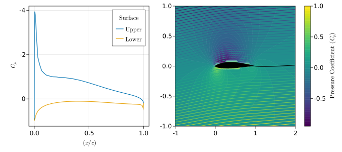

# AeroFuse

[](https://godotmisogi.github.io/AeroFuse.jl/stable/)
[](https://godotmisogi.github.io/AeroFuse.jl/dev/)
[](https://github.com/GodotMisogi/AeroFuse.jl/actions?query=workflow%3ACI+branch%3Amain)

<p align="center">

</p>

AeroFuse is meant to be a toolbox for aircraft design analyses. It currently provides convenient methods for developing studies in aerodynamics and structures, with implementations in other relevant fields such as flight dynamics and propulsion in progress.

**Authors**: Arjit Seth, Stephane Redonnet, and Rhea P. Liem

## Objectives

The current focus is to enable tutorials in computation for undergraduates in an aerospace educational curriculum, particularly at The Hong Kong University of Science and Technology. For this purpose, the code is written in a functional style replicating the mathematics presented in textbooks as much as possible.

An additional aim is to write code compatible with automatic differentiation libraries written in Julia.

## Features

**Disclaimer**: The implementations are work-in-progress, and hence the results may not be entirely accurate. Please exercise caution when interpreting the results until validation cases are added.

**Functioning:**

- Basic geometric tools for airfoil processing and wing design. 
- Steady, inviscid, incompressible, isentropic 2D and 3D aerodynamic analyses.
  - 2D - Doublet-source panel method
  - 3D - Vortex lattice method with derivatives
- Semi-/empirical profile drag prediction methods for wings.
- Finite-element beam model based on Euler-Bernoulli theory for structural analysis.




**In progress:**

- Aeroelastic analyses coupling vortex lattice and beam element models.
- 2D integral boundary layer solver for viscous-inviscid analyses.
- Generic, flexible and efficient flight dynamics integrator in 2 and 3 dimensions.
- Fuselage geometry parametrization and aerodynamic implementation.


## Installation

```julia
julia> using Pkg; Pkg.add("AeroFuse")
julia> Pkg.test("AeroFuse")
julia> using AeroFuse
```

## Citation

If you use AeroFuse in your research, please cite the following until any relevant material is actually published:

```bibtex
@software{AeroFuse,
  author  = {Arjit Seth, Stephane Redonnet, Rhea P. Liem},
  title   = {AeroFuse},
  url     = {https://github.com/GodotMisogi/AeroFuse},
  version = {0.4.2},
  date    = {2023-02-23},
}
```

## References

1. Mark Drela. _Flight Vehicle Aerodynamics_. MIT Press, 2014.
2. Joseph Katz and Allen Plotkin. _Low-Speed Aerodynamics, Second Edition_. Cambridge University Press, 2001.