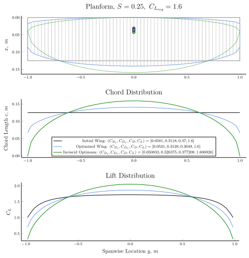

# AeroFuse

[](https://godotmisogi.github.io/AeroFuse.jl/stable/)
[](https://godotmisogi.github.io/AeroFuse.jl/dev/)
[](https://github.com/GodotMisogi/AeroFuse.jl/actions?query=workflow%3ACI+branch%3Amain)

<p align="center">

</p>

AeroFuse is meant to be a toolbox for aircraft design analyses. It currently provides convenient methods for developing studies in aircraft geometry, aerodynamics and structures, with implementations in other relevant fields such as flight dynamics and propulsion in progress.

**Authors**: Arjit Seth and Rhea P. Liem

## Objectives

The current focus is to enable tutorials in computation in an aerospace educational curriculum, particularly at The Hong Kong University of Science and Technology. An additional aim is to write code compatible with automatic differentiation libraries written in Julia for enabling multidisciplinary studies.

>**Disclaimer**: The implementations are work-in-progress, and hence the results may not be entirely accurate. Please exercise caution when interpreting the results until validation cases are added.

## Features

**Functioning:**

- Basic geometric tools for airfoil processing, wing (and tail), and fuselage design. 
- Steady, inviscid, incompressible, isentropic 2D and 3D aerodynamic analyses.
  - 2D - Doublet-source panel method
  - 3D - Vortex lattice method
- Semi-/empirical profile drag prediction methods for wings.
- Finite-element beam model based on Euler-Bernoulli theory for structural analysis.
- Automatic differentiation support primarily via [`ForwardDiff.jl`](https://github.com/JuliaDiff/ForwardDiff.jl).
- Optimization capabilities with these features.

**Aerodynamic Analysis:**


**Stability Analysis:**


**Optimization:**



**In progress:**

- Aeroelastic analyses coupling vortex lattice and beam element models. This is functioning, but a good interface is yet to be implemented.
- Adjoints for aerodynamic, structural and aerostructural design via [`ChainRulesCore.jl`](https://github.com/JuliaDiff/ChainRulesCore.jl).


## Installation

Please install the current stable release of [Julia](https://julialang.org/downloads/) for your operating system and execute the following commands in the REPL.

```julia
julia> using Pkg; Pkg.add("AeroFuse")
julia> Pkg.test("AeroFuse")
julia> using AeroFuse
```

## Citation

If you use AeroFuse in your research, please cite the following until any relevant material is actually published:

```bibtex
@article{Seth.IEEETrans.2023,
  author={Seth, Arjit and Redonnet, Stephane and Liem, Rhea P.},
  journal={IEEE Transactions on Education}, 
  title={MADE: A Multidisciplinary Computational Framework for Aerospace Engineering Education}, 
  year={2023},
  volume={},
  number={},
  pages={1-10},
  doi={10.1109/TE.2023.3281825}}
```