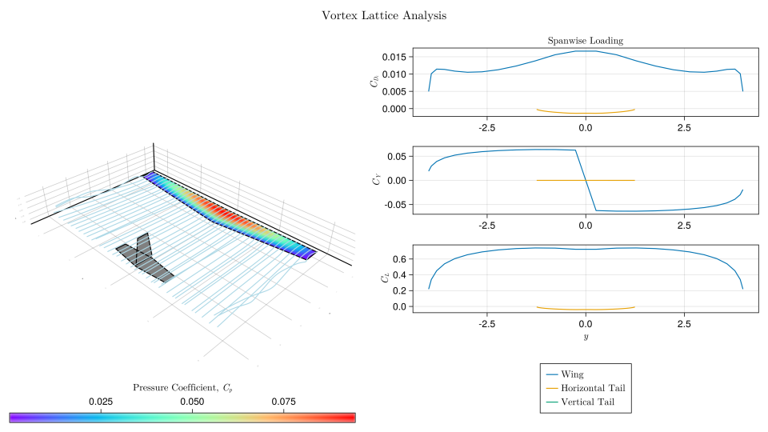

# AeroMDAO -- Aircraft Design Platform

AeroMDAO is meant to be a toolbox for aircraft design analyses. It currently provides convenient methods for developing studies in aerodynamics and structures, with aims to develop implementations in other relevant fields such as propulsion and flight dynamics.


### Aims

The current focus is to enable tutorials in computation for undergraduates in an aerospace educational curriculum, particularly at The Hong Kong University of Science and Technology. For this purpose, the code is written in a functional style replicating the mathematics presented in textbooks as much as possible.

## Features

AeroMDAO currently provides basic geometric tools for airfoil processing, and panel methods for inviscid 2D analyses. A vortex lattice method presented in Mark Drela's *Flight Vehicle Aerodynamics* has also been implemented for inviscid 3D analyses with some traditional viscous drag prediction methods.



**Disclaimer**: The current implementation is a major work-in-progress, and hence the results may not be entirely accurate. It has extensively avoided referring to other implementations for originality. Please exercise caution when interpreting the results until validation cases are added.

## Installation

```julia
julia> using Pkg; Pkg.add("AeroMDAO")
julia> Pkg.test("AeroMDAO")
julia> using AeroMDAO
```

## Citation

If you use AeroMDAO in your research, please cite the following until any relevant material is actually published:

```bibtex
@software{aeromdao,
  author  = {Arjit Seth, Rhea P. Liem, Stephane Redonnet},
  title   = {AeroMDAO},
  url     = {https://github.com/GodotMisogi/AeroMDAO},
  version = {0.3.0},
  date    = {2021-01-04},
}
```

## To Do

Key: × - Working, ∘ - In progress

- [×] Airfoil and wing parametrization
- [×] Doublet-source panel method in 2D
- [×] Vortex lattice method
- [×] Stability analysis
- [∘] Performance analyses
- [∘] Boundary layer solvers
- [ ] Doublet-source panel method in 3D
- [×] Beams for structural analyses
- [∘] Aerostructural analyses
- [∘] Flight dynamics engine
- [∘] Optimization problems
- [∘] Update documentation

## Contents

```@contents
Pages = ["geometry.md", "aerodynamics.md", "structures.md", "theory.md", "api.md"]
Depth =  5
```